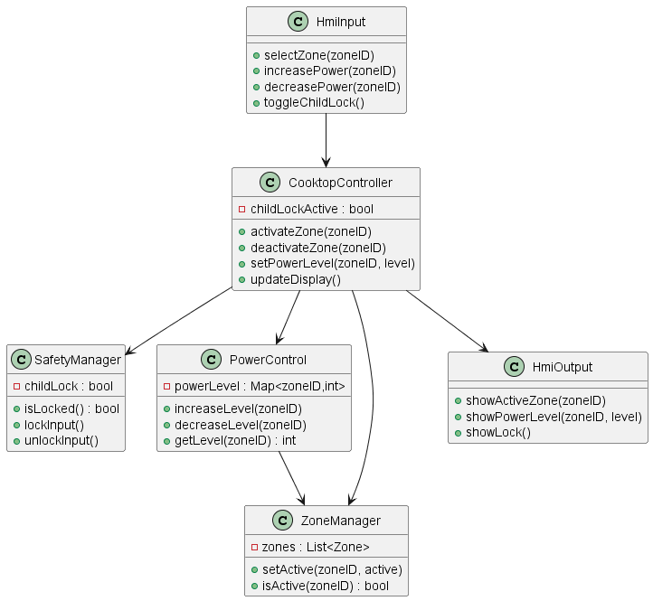
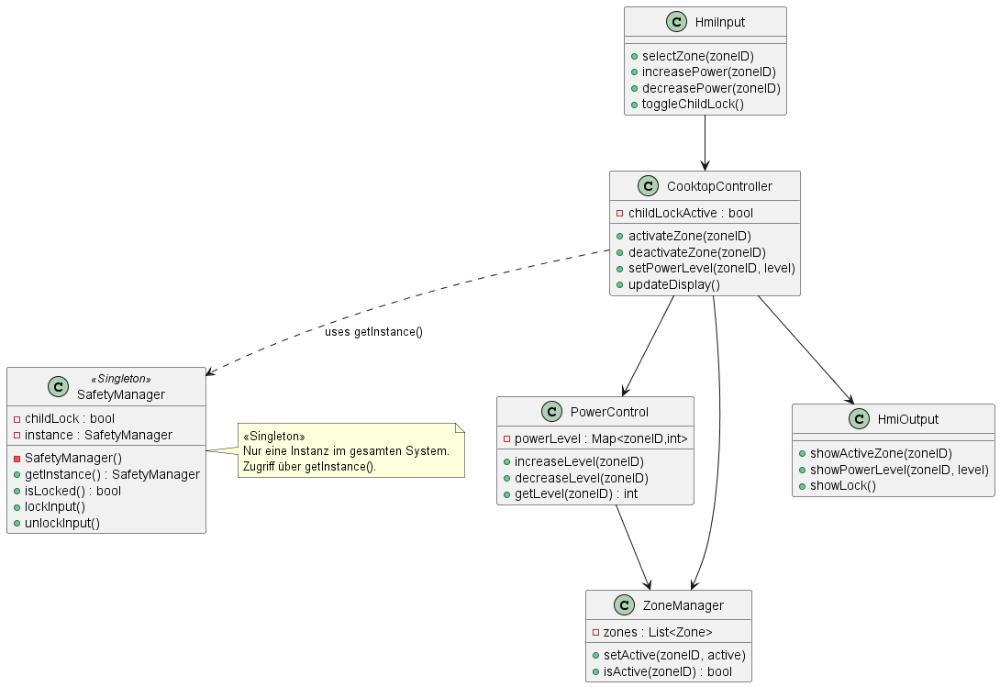
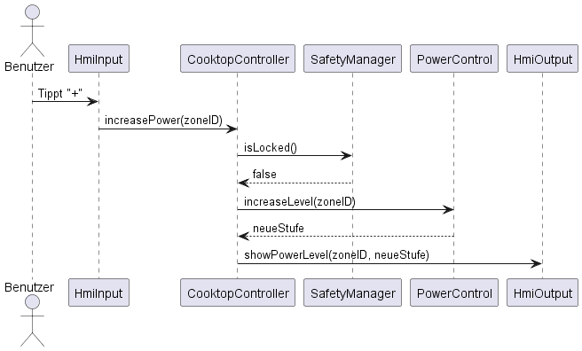
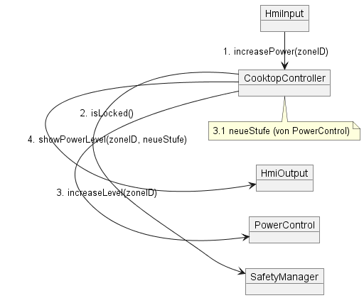

# Sprint 1 – Kochfeldsteuerung

## Ziel des Sprints
Sprint 1 definiert die Kernfunktionalität der Kochfeldsteuerung.  
Der Benutzer kann eine Kochzone aktivieren, die Leistungsstufe verändern und den aktuellen Zustand auf der Anzeige ablesen.  
Eingaben können durch eine Kindersicherung gesperrt werden.  
Die Systemreaktion auf Benutzereingaben muss innerhalb von 200 ms erfolgen.

---

## Scope Sprint 1 (Requirements)
Folgende Requirements sind Bestandteil von Sprint 1:
- F-01: Kochzonenaktivierung über Touch  
- F-02: Anzeige aktiver Kochzonen  
- F-03 / F-04: Leistungsstufeneinstellung (Plus/Minus)  
- F-07: Leistungsstufe jederzeit ablesbar  
- F-13: Kindersicherung sperrt Eingaben  
- NF-01: Reaktionszeit ≤ 200 ms  

Diese Requirements sind in der [Traceability-Matrix](https://github.com/andrefuchs3/Software-Engineering-Induktionskochfeld-Kochfeldsteuerung/blob/main/docs/Dokumentationen/Traceability-Matrix.md)
 markiert.

---

## Software-Design-Komponenten Sprint 1
- **hmiInput** – Erfasst Benutzereingaben (Zonenwahl, Leistungsänderung, Sperre)  
- **cooktopController** – Zentrale Steuerinstanz, prüft Sicherheit, löst Aktionen aus, aktualisiert Anzeige  
- **safetyManager** – Verwaltet die Kindersicherung und blockiert Eingaben bei Bedarf  
- **powerControl** – Setzt die Leistungsstufen der Kochzonen und hält die aktuelle Stufe vor  
- **zoneManager** – Verwaltet den Zustand der Kochzonen (aktiv/inaktiv etc.)  
- **hmiOutput** – Visualisiert den aktuellen Zustand (aktive Zone, Stufe, Sperre)

---

## UML-Diagramme Sprint 1

### Klassendiagramm

### Sequenzdiagramm  
Use Case: *Leistungsstufe erhöhen*  

### Kommunikationsdiagramm  
Strukturierte Sicht auf denselben Use Case  

