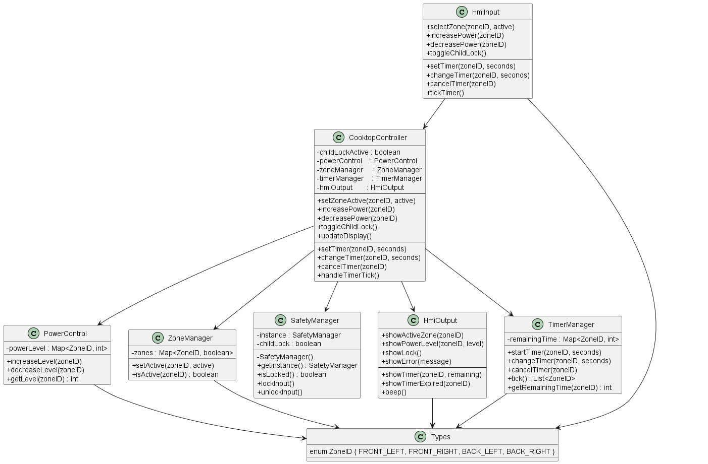
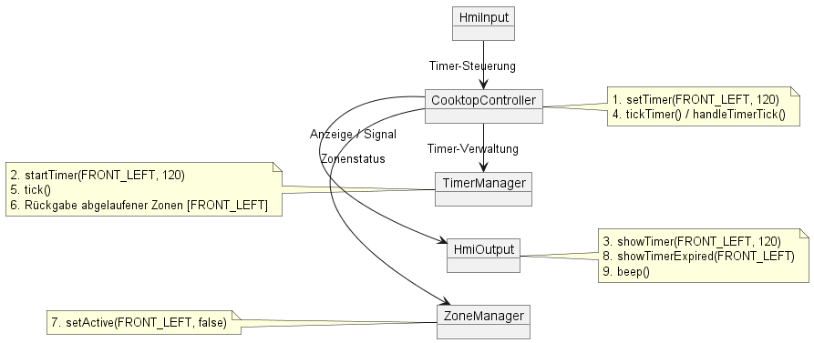
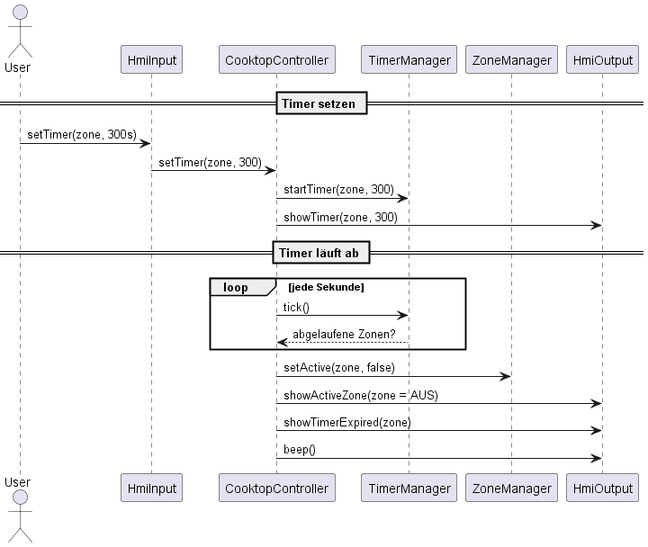

# Sprint 2 – Kochfeldsteuerung

## Ziel des Sprints

Sprint 2 erweitert die Kochfeldsteuerung um zeit- und sicherheitsrelevante Funktionen.  
Im Fokus stehen die Timerfunktionen pro Kochzone, die automatische Abschaltung nach Ablauf  
sowie eine verbesserte Status- und Fehleranzeige.

Der Benutzer soll in der Lage sein,

- für jede Kochzone einen Timer zu setzen, zu ändern und abzubrechen,
- sich über Restlaufzeiten und Ablauf des Timers informieren zu lassen,
- bei Ablauf des Timers eine visuelle und akustische Rückmeldung zu erhalten,
- Fehler- und Sperrzustände klar auf der Anzeige zu erkennen.

---

## Scope Sprint 2 (Requirements)

Folgende Requirements aus der Traceability-Matrix werden in Sprint 2 adressiert:

**Funktionale Anforderungen**

- **F-06**: Statusanzeige (aus, aktiv, Restwärme)  
- **F-08**: Fehler- oder Sperrzustände anzeigen  
- **F-09**: Timerfunktion pro Kochzone  
- **F-10**: Auto-Deaktivierung nach Timer-Ablauf  
- **F-11**: Visuelle & akustische Rückmeldung nach Ablauf  
- **F-12**: Timeränderung / Abbruch während Betrieb  

**Nicht-funktionale Anforderungen**

- **NF-04**: Anzeige aus 50 cm lesbar (wird konzeptionell berücksichtigt über klare, eindeutige Zustandsanzeigen)  

Die Zuordnung zu den Software-Design-Komponenten ist in der
[Traceability-Matrix](../Traceability-Matrix.md) dokumentiert.

---

## Software-Design-Komponenten Sprint 2

Im Vergleich zu Sprint 1 werden die bestehenden Komponenten erweitert und um einen
Timer-Manager ergänzt:

- **cooktopController**  
  - bleibt die zentrale Steuerinstanz  
  - delegiert Timerfunktionen an den `timerManager`  
  - entscheidet über Auto-Abschaltung und Restwärmeanzeige

- **timerManager** (neu)  
  - verwaltet Timer pro Kochzone (`ZoneID`)  
  - speichert Restlaufzeiten und erkennt Timerablauf  
  - informiert den `cooktopController` bei Ablauf eines Timers

- **hmiInput** (erweitert)  
  - ermöglicht das Setzen, Ändern und Abbrechen von Timern  
  - bietet eine Funktion zum „Ticks“ simulieren (z. B. ein Timer-Tick pro Sekunde)

- **hmiOutput** (erweitert)  
  - zeigt Timer-Restlaufzeiten und Ablaufmeldungen an  
  - kennzeichnet Fehler- und Sperrzustände deutlich  
  - stellt eine einfache „akustische“ Rückmeldung über Konsolenausgabe bereit

- **zoneManager** (erweitert)  
  - verwaltet weiterhin aktive Zonen  
  - wird nach Timerablauf zur Deaktivierung der Zone genutzt  
  - unterstützt die Darstellung des Status (aus, aktiv, Restwärme)

---

## UML-Diagramme Sprint 2

Die UML-Diagramme für Sprint 2 liegen im Ordner `docs/Sprint 2/UML-Diagramme/` und wurden mit PlantUML erzeugt.

**Klassendiagramm**  
  
  
zeigt insbesondere die neue Klasse `TimerManager` und die erweiterten
Methoden in `CooktopController`, `HmiInput` und `HmiOutput`.
    
**Kommunikationsdiagramm – Timerfunktion**  
  
  
stellt die Interaktionen zwischen `HmiInput`, `CooktopController`,
`TimerManager`, `ZoneManager` und `HmiOutput` dar.

**Sequenzdiagramm – Use Case „Timer läuft ab“**  
  
  
beschreibt den Ablauf vom Setzen eines Timers bis zur Auto-Abschaltung
der Kochzone und der Anzeige der Rückmeldung.

Die Diagramme sind konsistent mit der in Sprint 1 definierten Architektur und bilden
die Erweiterungen aus Sprint 2 ab.

# Testfälle – Sprint 2

## 1. Zielsetzung der Testaktivitäten

In **Sprint 2** wurden die zeitbasierten Funktionen der Kochfeldsteuerung implementiert bzw. erweitert:

- Timer pro Kochzone (setzen, ändern, abbrechen)
- automatische Deaktivierung nach Timerablauf
- Statuswechsel der Kochzonen (aktiv → aus/Restwärme)
- visuelle und akustische Rückmeldung nach Ablauf

Zur Sicherstellung der fachlichen und technischen Qualität wurden Testfälle auf zwei Ebenen definiert:

- **Modulebene**: Prüfung der Timerlogik im `TimerManager`
- **Integrationsebene**: Zusammenspiel von `HmiInput`, `CooktopController`, `TimerManager`,
  `ZoneManager` und `HmiOutput` inklusive Status- und Fehlermeldungen

---

## 2. Testfälle auf Modulebene

Die **Modulebene** fokussiert auf das Verhalten des `TimerManager` **ohne** Abhängigkeit von HMI oder Controller.  
Ziel ist die Überprüfung:

- korrekter Verwaltung der Restlaufzeiten
- korrekter Behandlung von Ablaufereignissen
- korrekter Änderung und Deaktivierung von Timern

[📄 Testfälle – Modulebene](../../Testfälle/Testfälle_Modulebene.md)

Die neuen Testfälle für Sprint 2 sind:

| Test-ID | Modul                  | Zweck                                            |
|--------:|------------------------|--------------------------------------------------|
| MT-04   | timer (TimerManager)   | Timer starten & Restzeit per `tick()` herunterzählen |
| MT-05   | timer (TimerManager)   | Änderung eines laufenden Timers (`changeTimer`) |
| MT-06   | timer (TimerManager)   | Sicheres Abbrechen eines Timers (`cancelTimer`) |

Diese Tests stellen sicher, dass die Timerlogik unabhängig von der restlichen Anwendung korrekt funktioniert.

---

## 3. Testfälle auf Integrationsebene

Die **Integrationsebene** prüft das Zusammenspiel der neuen Timerfunktionen mit HMI, Controller und Zonenverwaltung:

[📄 Testfälle – Integrationsebene](../../Testfälle/Testfälle_Integrationsebene.md)

| Test-ID | Komponenten                                            | Zielsetzung                                                                 |
|--------:|--------------------------------------------------------|------------------------------------------------------------------------------|
| IT-04   | HmiInput ↔ CooktopController ↔ TimerManager ↔ HmiOutput | Timer setzen & anzeigen                                                     |
| IT-05   | CooktopController ↔ TimerManager ↔ ZoneManager ↔ HmiOutput | Timerablauf: Zone deaktivieren, Stufe zurücksetzen, Benutzer informieren |
| IT-06   | HmiInput ↔ CooktopController ↔ TimerManager ↔ HmiOutput | Timer ändern & abbrechen                                                   |
| IT-07   | HmiInput ↔ CooktopController ↔ TimerManager ↔ ZoneManager ↔ HmiOutput | Auto-Deaktivierung nach Timerablauf (End-to-End)                        |
| IT-08   | HmiInput ↔ CooktopController ↔ TimerManager ↔ HmiOutput | Visuelle & akustische Rückmeldung nach Ablauf                             |
| IT-09   | HmiInput ↔ CooktopController ↔ TimerManager ↔ HmiOutput | Timeränderung/Abbruch ohne Ablaufereignis (End-to-End)                    |

Damit wird sichergestellt, dass die Timerereignisse korrekt durch die Schichtenkette  
(HMI → Controller → Timer/Zonen → HMI-Ausgabe) laufen.

---

## 4. Bezug zur Traceability-Matrix

Die Testfälle aus Sprint 2 sind direkt mit den erweiterten Requirements verknüpft.

**Anforderungsauszug gemäß** [Traceability-Matrix](../Traceability-Matrix.md)

| Requirement | Inhalt                                   | Abgedeckt durch                            |
|------------|-------------------------------------------|--------------------------------------------|
| F-06       | Statusanzeige (aus, aktiv, Restwärme)     | IT-05, IT-07                               |
| F-08       | Fehler-/Sperrzustände anzeigen            | IT-03 (Sprint 1), IT-05                    |
| F-09       | Timerfunktion pro Kochzone                | MT-04, IT-04, IT-06, IT-09                 |
| F-10       | Auto-Deaktivierung nach Timer-Ablauf      | MT-05, IT-05, IT-07                        |
| F-11       | Visuelle & akustische Rückmeldung         | IT-05, IT-08                               |
| F-12       | Timeränderung / Abbruch                   | MT-06, IT-06, IT-09                        |

Die nicht-funktionale Anforderung **NF-04** (Lesbarkeit der Anzeige) wird durch die eindeutigen  
HMI-Statusmeldungen und Timeranzeigen konzeptionell unterstützt.

---

## 5. Durchgeführte Testläufe und Dokumentation der Ergebnisse

Zur Verifikation der in **Sprint 2** implementierten Timerfunktionen wurde ein manueller Testdurchlauf durchgeführt.  
Alle definierten Testfälle auf **Modulebene** (MT-04 bis MT-06) und **Integrationsebene** (IT-04 bis IT-09) wurden ausgeführt.

Die Testausführung erfolgte über die Datei [`Test_Sprint2.java`](../../tests/Test_Sprint2.java), welche

- die notwendigen **Systemzustände vorbereitet**,  
- die **Aktionen der jeweiligen Testfälle sequenziell ausführt**,  
- die **Beobachtungen strukturiert in der Konsole protokolliert**.

Die Konsolenausgaben wurden mit den in den Testfalldefinitionen beschriebenen  
Erwartungen (Statuswechsel, Timerwerte, Fehlermeldungen, Beep-Signale) abgeglichen.  
Alle Testfälle wurden im Rahmen der manuellen Sichtprüfung als **bestanden** bewertet.

---

## 6. Vergleich von Architektur/Design und Implementierung (Sprint 2)

Die Implementierung der Timerfunktionen wurde mit den geplanten Erweiterungen von Architektur und Design abgeglichen.

### Übereinstimmungen

- Der **TimerManager** ist wie vorgesehen als eigenes Modul implementiert und verwaltet Timer pro `ZoneID`.
- Der `CooktopController` ruft den `TimerManager` ausschließlich über klar definierte Methoden  
  (`startTimer`, `changeTimer`, `cancelTimer`, `handleTimerTick`) auf.
- `HmiInput` kapselt alle Benutzereingaben rund um die Timerfunktion (`setTimer`, `changeTimer`, `cancelTimer`, `tickTimer`).
- `HmiOutput` stellt Methoden für Timeranzeige und Ablaufmeldungen bereit (`showTimer`, `showTimerExpired`, `beep`).
- `ZoneManager` wird – wie im Design vorgesehen – vom Controller genutzt, um Kochzonen nach Timerablauf zu deaktivieren.

Damit bleibt die **Schichtenarchitektur** HMI → Controller → Fachmodule auch in Sprint 2 konsistent.

### Festgestellte Abweichungen / Konkretisierungen

1. **Timer-Ticks werden manuell über HmiInput simuliert**  
   - Im Design war der Timerablauf abstrakt formuliert.  
   - In der Implementierung werden Ticks explizit über `hmi.tickTimer()` ausgelöst, um die Tests im Konsolenprogramm reproduzierbar zu machen.  
   - Diese Konkretisierung ändert die Architektur nicht, erleichtert aber die Testbarkeit.

2. **Einfache, synchrone Timerlogik**  
   - Statt eines echten asynchronen Timers (Thread/TimerTask) wird eine einfache, synchrone Tick-Logik verwendet, die bei jedem Aufruf von `tick()` die Restzeiten reduziert.  
   - Dies entspricht dem Übungsrahmen und ist mit dem ursprünglichen Architekturlevel kompatibel.

Insgesamt liegt eine **hohe Übereinstimmung** zwischen dem in Sprint 2 geplanten Design und der tatsächlich umgesetzten Lösung vor.

---

## 7. Erkenntnisse aus Sprint 2 (Retrospektive)

Im Rahmen von Sprint 2 wurden sowohl fachliche als auch prozessbezogene Erfahrungen gesammelt.

### 7.1 Positiv aufgefallene Punkte

- **Wiederverwendbare Architektur**  
  Die in Sprint 1 eingeführte Schichtenstruktur ließ sich ohne größere Anpassungen um Timerfunktionen erweitern.  
  Neue Logik konnte sauber im `TimerManager` gekapselt werden.

- **Klare Testfalldefinitionen helfen bei der Umsetzung**  
  Die detaillierten Tabellen für MT- und IT-Tests haben geholfen, den `TimerManager` und die Integration gezielt zu implementieren.  
  Die spätere Kontrolle per Konsolenausgabe war dadurch deutlich einfacher.

- **Regressionstests aus Sprint 1**  
  Durch das getrennte Ausführen von `Test_Sprint1.java` konnten die ursprünglichen Funktionen (Leistungsstufen, Kindersicherung, Zonenaktivierung) nach den Änderungen in Sprint 2 erneut geprüft werden.  
  Es traten keine Regressionen auf.

### 7.2 Herausforderungen und Verbesserungspotenziale

- **Hoher manueller Aufwand bei den Tests**  
  Auch in Sprint 2 erfolgt die Bewertung der Testergebnisse hauptsächlich über die Konsole.  
  Für viele Testfälle ist eine manuelle Sichtprüfung notwendig, was fehleranfällig und zeitaufwändig ist.

- **Komplexität der Timerfälle**  
  Durch die Kombination aus Zonenstatus, Leistungsstufen, Kindersicherung und Timern entstehen viele Zustandskombinationen.  
  Das macht es schwierig, alle Pfade im Kopf zu behalten und erhöht den Dokumentationsaufwand.

- **Abhängigkeit zwischen Dokumentation und Code**  
  Bei Änderungen am Testcode oder an der Timerlogik muss die Testfalldokumentation sehr sorgfältig nachgezogen werden, damit beide Seiten konsistent bleiben.

### 7.3 Konsequenzen für Sprint 3

Aus den Erfahrungen in Sprint 2 ergeben sich folgende Maßnahmen für Sprint 3:

- **Einführung automatisierter Tests (z. B. JUnit)**  
  - Abbildung der bestehenden MT- und IT-Testfälle als JUnit-Tests, um Regressionen schneller zu erkennen.  
  - Automatisierte Soll-/Ist-Vergleiche statt rein manueller Konsolenprüfung.

- **Weiterführung der Traceability**  
  - Neue oder geänderte Requirements sollen direkt mit Testfällen und Codeänderungen verknüpft werden.  
  - Die Traceability-Matrix bleibt zentrales Werkzeug, um den Überblick über die Abdeckung zu behalten.

- **Bewusste Planung von Testfällen vor der Implementierung**  
  - Testfälle (insbesondere Integrationstests) sollen früh im Sprint entworfen werden.  
  - Die Implementierung kann sich dann stärker an diesen Akzeptanzkriterien orientieren.

Diese Erkenntnisse bilden die Grundlage für die Planung und Umsetzung von **Sprint 3**.

